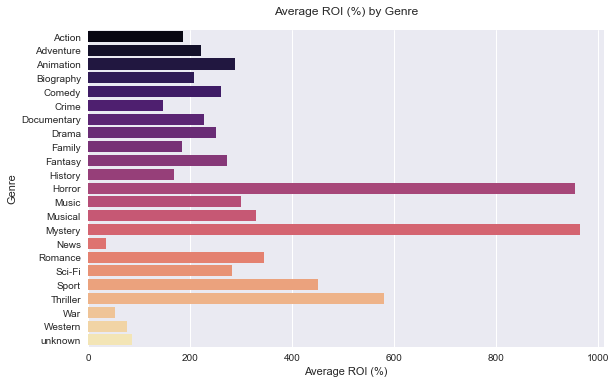

# Table of Contents
1. [Business Overview](#business-overview)
2. [Business Understanding](#business-understanding)
3. [Data Understanding and Analysis](#data-understanding-and-analysis)
4. [Visualisations](#data-visualisation)
5. [Conclusion](#Conclusion)

# BUSINESS OVERVIEW

The movie industry is a dynamic and highly competitive field, with numerous production companies striving to capture the attention of global audiences. As the entertainment sector continues to expand, understanding the elements and factors that influence a movie's performance has become essential for newcomers to the market. This respository aims to provide valuable insights into the current film industry trends, helping to guide the strategic decisions of a new movie studio. By examining recent box office data,movie ratings and film costs we will identify key patterns and trends in audience preferences, enabling the studio to make informed choices regarding genres, directors, and formats that are most likely to succeed. Our goal is to optimize the studio's performance by offering practical recommendations based on data-driven analysis.

# BUSINESS UNDERSTANDING

In recent years, the movie industry has experienced significant growth and transformation driven by the advancement in technology and consumer preferences for this mode of entertainment.As a result,there is a growing demand for high-quality, diverse and engaging content.
Recognizing this the company is seeking to capitalize on the expanding market by venturing into the movie business
Our objective is to establish a movie studio that produces a wide range of films catering to various audience segments.

## STAKEHOLDERS

- Company board of directors
    These are the people who would make the strategic decisions and allocate the resources for this new venture

- The company creative team
    These are directors who would be tasked in creating content for the new studio

- Marketing and sales team
    These are the people who will be promoting the movies and ensure that it reaches the targeted audience

- Audience
    These are the people who will consume the content that will be produced by the movie studio

## BUSINESS QUESTION

To understand the movie business and provide analysis on audiences preferences

# DATA UNDERSTANDING AND ANALYSIS

To answer the business question we analysed data from company's websites that hold information such as:
- production cost
- domestic gross
- foregn gross
- audience rating

## DATA SOURCES
Our main dataset was sourced from the IMDB website.The IMDB website provided us with information on:
- movie name
- genre
- year of release
- Movie runtime
- IMDB rating
- Director of the movie

To compliment this dataset we merged the IMDB dataset to
- Box Office Mojo Website - This website provided financial information of various movies
- Moviesdb Website - This website provided information on the popularity of various movies and the ratings held by company
- The Numbers Website - This website provided financial information on various movies

## DATA DESCRIPTION

After data cleaning our dataset had the following columns that would be analysed so to provide a better understanding of the movie industry which were

 1. title                                  
 2. genre                                       
 3. director                   
 4. studio                   
 5. release_year                     
 6. release_month                    
 7. film_runtime                    
 8. imdb_averge_rating       
 9. imdb_number_of_votes     
 10. production_budget    
 11. domestic_gross          
 12. foreign_gross                   
 13. worldwide_gross          
 14. original_language        
 15. popularity               
 16. moviedb_average_rating  
 17. moviedb_number_of_votes  
 18. ROI 

 ### Note
 A movie could belong to more than one genre

 A movie could have more than one director directing it

 Domestic gross means revenue generated from USA audience this is because the dataset was collected from USA companies

 Foreign gross means revenue generated from the rest of the world excluding USA

 Worldwide gross means the cumulative revenue generated

 ROI means the Return Of Investment 

 # DATA VISUALISATION
 ## Top ten movies by worlwide gross earnings

The above figure shows the top movies that have the highest revenue worldwide. Majority of these movies and were big cultural moments on the year they came out for example Avenger Infinity War

## Number of movies per genre

The above figure shows which genres most movies are based on. From the above visualisations we discover that majority of the movies are considered to belong to the drama genre while many studios don't produce movies based on the News genre

## AVERAGE Return On Investment (ROI) by genre

The above figure shows that the Horror and Mystery genres have the highest ROI for studios in the movie industry. This is due to the relatively low production costs incurred by studios to produce these movies compared to the high profits they generate.

## Tableau Dashboard
 **Tableau Dashboard**
 [View Dashboard](https://public.tableau.com/app/profile/edwin.maina/viz/Phase2Projectdashboard/Dashboard1?publish=yes)

 # Conclusion

Based on the comprehensive analysis and exploratory data analysis (EDA) conducted, the following conclusions can be drawn:

The most common genre produced in the film market is the drama genre and trailing at the end is the news genre.

Considering the return on investment.The mystery and thriller carry the weight consecutively mystery having a return on investment(ROI) of 964.2% and again the news genre comes last with the least ROI.

Cultural relevance is a crucial aspect to consider when targeting international markets. Movies that excel domestically may not achieve the same level of success globally due to variations in cultural preferences. Adapting movie concepts and marketing strategies to align with the cultural nuances of different regions can enhance international performance.Fron our visualizations on the domestic and the foreign gross incomes we can see that those that achieve the highest gross income domestically are not the same  that rank highest in the foreign market.

From our scatter plots there is a positive correlation between popularity and the incomes suggesting that the popular movies are the most that rake in the most income.

# Recommendations

From our conclusions above and comprehensive analysis of our data,the following reccomendations can be made for our new movie studio.

Genre selection: The Mystery and horror should be considered when making an investment. They have proved to be the most profitable genres in the market.

Focus Beyond Budget: While maintaining a reasonable production budget, prioritize elements such as compelling storytelling, talented performances, and innovative marketing strategies. These factors can have a significant impact on a movie's success, regardless of the budget allocated.

Popularity as a success indicator: Pay attention to the most popular movies,genres etc as popularity has shown a positive correlation with both domestic and foreign gross incomes. The most popular genres should be considered for investment.

Market Research and Localization: Conduct thorough market research to understand the cultural preferences and nuances of different international markets. Tailor movie concepts, promotional campaigns, and distribution strategies to align with the target audience's cultural sensibilities and maximize global appeal.

By implementing these recommendations, our new movie studio can enhance its competitive position in the industry and increase the likelihood of producing successful movies with significant  revenue.

